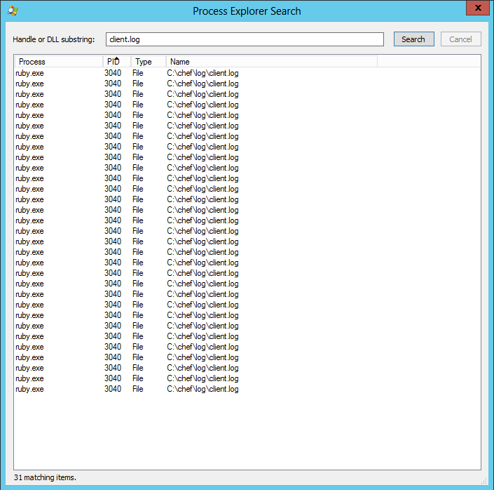

# Windows Log Rotate

The requirements are
1. Logrotate like Linux
2. Be able to delete the (currently in use) log file if necessary

TL;DR here is some code to perform a log rotate or create daily log for Windows.

For Linux you can use the chef-client cookbook (https://github.com/chef-cookbooks/chef-client#configuration-includes) or logrotate cookbook.

## Usage

#### attributes: default

 Key                                         | Type          | Description                                       | Default
---------------------------------------------|---------------|---------------------------------------------------|---------
`['windows_logrotate']['log_type']`          | String        | Used to determine the log type                    | `daily_log`
`['windows_logrotate']['days_to_keep_logs']` | Fixnum        | Number of days to keep log                        | 7
`['windows_logrotate']['log_file']`          | String        | Full path and name of log file                    | c:\chef\log\client.log
`['windows_logrotate']['shift_age']`         | String/Fixnum | Used when log_type is set to 'rotate'             | `daily`
`['chef_client']['service_log_file']`        | String        | Allows Chef service to use a custom log filename  | `client.service.log`

log_types valid values 
* daily_log - new log file is created for each day, the date is appended to the log file name
* rotate_log - log file is archived every day

When log_type is rotate_log uses the standard Ruby logger, shift_age needs to be one of the Ruby logger supported values
* Frequency, a number in days
* daily
* weekly
* monthly

Check latest Ruby docs for settings (http://ruby-doc.org/stdlib-2.4.0/libdoc/logger/rdoc/Logger.html)

If running Chef as a service and rotate_log is selected then the Chef-Client runner and Chef service log files need to be different, i.e. service log file = c:/chef/log/service.log and Chef-Client runner c:/chef/log/client.log (see Background/Windows Service), the configure_chef_service_logfile recipe does this.

The recipes are
* logrotate - this will close the current logger and create a new logger
* delete_old_log_files - applies a mask to the log file name, deletes log files based on create time
* configure_chef_service_logfile - this recipe modifies the code in chef-client windows_service by changing the service install command and client.service.rb configuration file and allowing you to specify a custom log file name and not be forced into using client.log

Selecting daily_lof or rotate_log is inside a Chef recipe (logrotate.rb) but the code calls out to a method so could equally be called at the end of a library file ensuring that the log is setup and ready to go in the compile phase capturing Chef::Log and immediate calls to log resource (i.e. compile time run_action specified  on resource declaration) output.

## Background

### Logrotate

In principal, this was fairly simple request, with Chef-Client 11.18.6 it took around an hour or so to prototype something with test kitchen.

All the code presented here is from Chef-client 12.17.44 which is a much tidier codebase but the technique and principals are the same.

The first thing to establish is how the current logging mechanism works.

In Chef there is a log resource which is executed at converge time, however you can also log output at compile time with Chef::Log.

Chef::Log is a class in the Chef codebase so first task is to locate the Chef::Log class.

Turns out the Chef::Log class is nice and light code wise.

```ruby
class Chef
  class Log
    extend Mixlib::Log

    # Force initialization of the primary log device (@logger)
    init(MonoLogger.new(STDOUT))

    class Formatter
      def self.show_time=(*args)
        Mixlib::Log::Formatter.show_time = *args
      end
    end
    ...
```

The majority of the Chef::Log code comes from Mixlib::Log https://github.com/chef/mixlib-log

Mixlig::Log is a simple to use Ruby module

```ruby
require "logger"
require "mixlib/log/version"
require "mixlib/log/formatter"

module Mixlib
  module Log

    @logger, @loggers = nil

    LEVELS = { :debug => Logger::DEBUG, :info => Logger::INFO, :warn => Logger::WARN, :error => Logger::ERROR, :fatal => Logger::FATAL }.freeze
    LEVEL_NAMES = LEVELS.invert.freeze

    def reset!
      close!
      @logger, @loggers = nil, nil
    end

    # An Array of log devices that will be logged to. Defaults to just the default
    # @logger log device, but you can push to this array to add more devices.
    def loggers
      @loggers ||= [logger]
    end
    ....
```

After reading Mixlib::Log we can see there is an init method which sets up the logger.

Searching the Chef codebase for Chef::Log.init (alternatively we could have started our search with Chef::Config[:log_location]) we see a handful of results, one of the search results points to application.rb which is probably the most interesting place to start.

```ruby
 def configure_logging
    configure_log_location
    Chef::Log.init(MonoLogger.new(Chef::Config[:log_location]))
    if want_additional_logger?
      configure_stdout_logger
    end
    Chef::Log.level = resolve_log_level
  rescue StandardError => error
    Chef::Log.fatal("Failed to open or create log file at #{Chef::Config[:log_location]}: #{error.class} (#{error.message})")
    Chef::Application.fatal!("Aborting due to invalid 'log_location' configuration", error)
  end
```

We can see that the configure logging method is calling the init method from Mixlib::Log and is using MonoLogger.

MonoLogger is part of Chef and is based on the Ruby Logger.

```ruby
class MonoLogger < Logger
  def initialize(logdev)
    @progname = nil
    @level = DEBUG
    @default_formatter = Formatter.new
    @formatter = nil
    @logdev = nil
    if logdev
      @logdev = LocklessLogDevice.new(logdev)
    end
  end

  class LocklessLogDevice < LogDevice

    def initialize(log = nil)
      @dev = @filename = @shift_age = @shift_size = nil
      if log.respond_to?(:write) && log.respond_to?(:close)
        @dev = log
      else
        @dev = open_logfile(log)
        @filename = log
      end
      @dev.sync = true
    end
    ...
```

Knowing this information we can change the logger during a Chef-Client run.

However the Ruby logger log rotate works by moving the current log file and appending the date, a new log file is created and to append to, i.e.
1. client.log (moved to) client.log.<date>
2. new client.log file created

### Windows Services

Running Chef as a service introduces some problems, notably file locking, one of the files that is locked is the service client log file which in most cases happens to be the same name as the Chef-Client runner log file, i.e. client.log

Simulating a chef-client running as a service using test kitchen is quite simple.
* Include the chef-client cookbook to your dependencies
* Add chef-client::config to your run list
* Add chef-client::service to your run list
* Modify any configuration for Chef-Client cookbook, I recommend setting interval and splay time to low values
* Converge
* Log on to your VM
* Open a command window and run chef-zero, it will tell you it's listening on http://127.0.0.1
* Open a command window, change folder to the test kitchen temp folder (normally %%USERPROFILE%%\AppData\Local\Temp\kitchen) and run knife upload . -c client.rb
* Open explorer, change folder to the chef runtime folder (normally C:\chef), copy the client.pem from test kitchen temp folder to chef runtime folder
* Modify client.rb in chef runtime folder to change server URL from chefzero://127.0.0.1 to http://127.0.0.1
* Open Windows services, right click on services, select chef-client and run!

My setup of test kitchen uses Vagrant and VirtualBox, when a VirtualBox VM is running it normally synchronises the time with the host computer but this can be changed, useful if you need to span dates such as testing testing log rotate.

As expected when Chef runs as a service the Chef-Client log file did not rotate because the log file was being locked by the Chef service.

Some background, the Chef service actually runs Ruby and specifies a command of 
```
"C:\opscode\chef\embedded\bin\ruby" "C:\opscode\chef\bin\chef-windows-service"  -c C:\chef\client.service.rb
```

The service dependencies are as follows
```
- Windows Management Instrumentation
	- Remote Procedure Call (RPC)
	- DCOM Server Process Launcher
	- RPC Endpoint Mapper
```

The code in the Chef source that deals with Windows Service is called windows_service.rb. The code looks complicated simply because of the way Windows services have to be written (using certain stubs and callbacks).

```ruby
class Chef
  class Application
    class WindowsService < ::Win32::Daemon
      include Mixlib::CLI
      include Chef::Mixin::ShellOut
      ....
```

The code for setting up the logger in windows_service.rb is similar to what we've seen before in application.rb.

```ruby
  def service_init
    ...
    reconfigure
    Chef::Log.info("Chef Client Service initialized")
  end

  def reconfigure(startup_parameters = [])
    ...
    configure_logging
    ...
  end

  def configure_logging
    Chef::Log.init(MonoLogger.new(resolve_log_location))
    if want_additional_logger?
        configure_stdout_logger
    end
    Chef::Log.level = resolve_log_level
  end

  def configure_stdout_logger
    stdout_logger = MonoLogger.new(STDOUT)
    stdout_logger.formatter = Chef::Log.logger.formatter
    Chef::Log.loggers << stdout_logger
  end

  def want_additional_logger?
    ( Chef::Config[:log_location] != STDOUT ) && STDOUT.tty? && (!Chef::Config[:daemonize]) && (Chef::Config[:force_logger])
  end
```

The reconfigure method calls configure_logging which sets up the logger. The reconfigure method is also called from the service_main method.

```ruby
  def service_main(*startup_parameters)
    ...
    while running?
       # Grab the service_action_mutex to make a chef-client run
       @service_action_mutex.synchronize do
         begin
            Chef::Log.info("Next chef-client run will happen in #{timeout} seconds")
            @service_signal.wait(@service_action_mutex, timeout)

            # Continue only if service is RUNNING
            next if state != RUNNING

            # Reconfigure each time through to pick up any changes in the client file
            Chef::Log.info("Reconfiguring with startup parameters")
            reconfigure(startup_parameters)
            timeout = Chef::Config[:interval]

            # Honor splay sleep config
            timeout += rand Chef::Config[:splay]
```

After running Chef as a service, the log file did not rotate because the log file was being locked.

Downloading SysInternals ProcExplorer shows that Ruby is locking the file, what is interesting is that the lock count increases on each Chef run, this is most likely due to calling reconfigure in the service_main method!



Initial thoughts were that we could release the locks on the client.log file by
* Calling reset! on Chef::Log
* Using ObjectSpace to close the file handles

Two pieces of code were added to the Chef cookbooks, one for writing debug output to a file

```ruby
def debug_out(msg)
  open('c:/chef/log/debug.txt', 'a') do |f|
    f.puts "%s %s" % [Time.now.utc, msg]
  end
end
```

The other to close the file handles using ObjectSpace, example code below is hardcoded to look for client.log in the files path.

```ruby
ObjectSpace.each_object(File) do |f|
  if f.path.include?('client.log')
	debug_out('Found client.log')
	if f.closed?
	  debug_out('Client.log Closed')
	else
	  debug_out('Closing client.log')
	  f.close
	  debug_out("Closed client.log. Status #{f.closed?}")
	end
  end
end
```

The debug output showed that the client.log files were being closed but did not release the locks on the client.log file.

The most likely reason is that there must be an Object reference to the Chef::Log that is still in scope, trying to unhook that and forcing a garbage collection is not something we want to do, particularly as the reference is higher up in the service_main method.

Having run tests I can see that when we use the log rotate or daily log and choose a filename other than client.log the final output of the chef client run is sent to the original client.log file (text is below).

```
INFO: Next chef-client run will happen in 300 seconds
```

This message is contained in windows_service.rb service_main method, so it does look like the object reference to the logger is maintained, the theory is proven later on when we set different log files for the Chef service and Chef-Client runner.

#### Can we deleted a locked file?

If chef is running as a service the client.log file is locked because there is a reference to the client.log file from the windows_service.rb service_main method, so the answer to can you delete the current log file is is a resounding "no" if the Chef service and Chef-Client log file names are the same. But to be honest, if you did successfully delete the client.log there would be no way of viewing the output from the Chef windows service so the next section is a bit of fun. 

There are some articles that would indicate that a locked file can be moved and marked for deletion, the technique gives the illusion that the file had been deleted but actually just moves it to a temporary location, deletion will occur at a later time, typically when the server is rebooted.
http://stackoverflow.com/questions/3763526/how-to-remove-the-file-which-has-opened-handles

The technique uses MoveFileEx/MoveFileExW https://msdn.microsoft.com/en-us/library/windows/desktop/aa365240(v=vs.85).aspx and DeleteFile/DeleteFileW https://msdn.microsoft.com/en-us/library/windows/desktop/aa363915(v=vs.85).aspx windows API functions.
http://stackoverflow.com/questions/1040/how-do-i-delete-a-file-which-is-locked-by-another-process-in-c

In Ruby the easiest way to call Windows API functions is to use the Foreign Function Interface (FFI) library.

Luckily for us Chef already uses the FFI library so to impliment the use of these methods is easy.

Ignoring basic rules for not re-opening classes or monkey patching, the easiest way to add a Windows method is to extend what is already in Chef. Add a library file to extend the class

```ruby
class Chef
  module ReservedNames::Win32
    module API
      module File
		MOVEFILE_COPY_ALLOWED            = 0x00000002
		MOVEFILE_CREATE_HARDLINK         = 0x00000010
		MOVEFILE_DELAY_UNTIL_REBOOT      = 0x00000004
		MOVEFILE_FAIL_IF_NOT_TRACKABLE   = 0x00000020
		MOVEFILE_REPLACE_EXISTING        = 0x00000001
		MOVEFILE_WRITE_THROUGH           = 0x00000008

    	safe_attach_function :MoveFileExW, [:LPCTSTR, :LPCTSTR, :DWORD], :BOOL
        safe_attach_function :DeleteFileW, [:LPCTSTR], :BOOL
      end
    end
  end
end
```

Call the methods in a recipe (or create a class or method in a library file)

```ruby
source_path = Chef::Util::PathHelper.canonical_path('c:\chef\log\client.log').to_wstring
dest_path = Chef::Util::PathHelper.canonical_path('c:\chef\log\old_client.log').to_wstring
result = Chef::ReservedNames::Win32::API::File.MoveFileExW(source_path, dest_path, Chef::ReservedNames::Win32::API::File::MOVEFILE_REPLACE_EXISTING)
```

Unfortunately, any attempt to move or delete the log file fails, it doesn't matter too much, we have enough information now to manipulate the log files.

### Multiple client log files

If you cast your mind back to the Chef-Client service there is a custom configuration file specified called client.service.rb.

Changing the log file name in client.service.rb so that it is different from the log file name in client.rb shows that it is infact the log file opened by the service that is being locked (the default setting for Chef-Client and Chef service is c:/windows/client.log).

Amend client.service.rb log_location value from c:/chef/log/client.log to c:/chef/log/service.client.log
```ruby
if File.exists?(%q|C:/chef/client.rb|)
   Chef::Config.from_file(%q|C:/chef/client.rb|)
end

log_location "C:/chef/log/service.client.log"

interval 300

splay 30
```

The log_location value in client.rb used by the Chef-Client runner can be left as c:/chef/log/client.log
```ruby
chef_server_url "http://localhost:8889"
client_fork true
log_location "C:/chef/log/client.log"
validation_client_name "chef-validator"
verify_api_cert true
node_name "Test-Server"
# Do no crash if a handler is missing / not installed yet
begin
rescue NameError => e
  Chef::Log.error e
end

Dir.glob(File.join("C:/chef", "client.d", "*.rb")).each do |conf|
  Chef::Config.from_file(conf)
end
```

The client.log file can now be deleted between Chef-Client runs without any issues, the service.client.log file remains locked for as long as the Chef-Client service is running.

The output of service.client.log relates to any messages the Chef service generates, the client.log will relate to each Chef-Client run started by the service.

So, if you DON'T want your Chef-Client log file locked then specify a different log file for the Chef service and Chef-Client.

There is a much less painful alternative to running Chef-Client as a service which is to run Chef-Client as a scheduled task
* does not lock files
* should not suffer memory footprint issues

Hope this helps!
